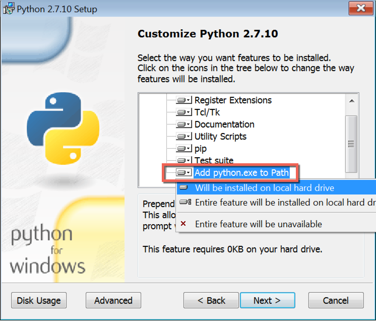
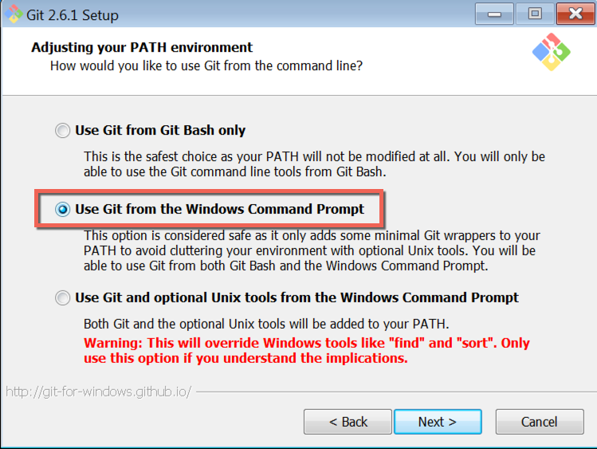

.. _local_development_installation_windows:

***************************
Install software on Windows
***************************

.. note:: note for Joseph: I have kept exactly the same structure as for the standard installation document; I hope your steps work in this order but if not you will need to re-arrange. Feel free to keep or remove any existing text.

Installing the required software on Windows requires some special steps.

.. attention:: **Not using Microsoft Windows?**

    Please use the :ref:`standard installation instructions <local_development_installation>`.

Python 2.7
==========

Download the latest version of **Python 2.7** (note that Python 3 is currently not suitable) from
the `official Python website <https://www.python.org/downloads/windows/>`_ and run the installer.

During the installation step "Customize Python", make sure that you have selected the option "Add
Python to Path".

Git
===

Download the latest version of Git for Windows from the `Git downloads page
<https://git-scm.com/download/win>`_ and run the installer.

During the installation, make sure you select the option to "Use Git from the Windows Command
Prompt" like shown below:

.. _docker_toolbox_windows:

Docker Toolbox
==============

Download the latest version of `Docker Toolbox <https://www.docker.com/toolbox>`_ and run the
installer. This will configure VirtualBox (which will run the virtual machines your local Aldryn
enviroment requires) and Kitematic (a Docker machine controller).

Docker Compose
==============

Install the latest version of ``docker-compose``, a command-line tool for managing Docker containers, using pip.

In your terminal (typically, the ``cmd.exe`` application) run::

    pip install git+git://github.com/docker/compose.git

This will obtain the latest version from the official Docker Compose Git repository, and install it.

Aldryn command-line client
==========================

Install the Aldryn command line client::

    pip install aldryn-client

.. note::

    until this is formally released on PyPI, use::

        pip install -e git+git://github.com/aldryn/aldryn-client.git@v2#egg=aldryn_client

If you already have an older version of the client installed, use the ``--update`` option::

    pip install --update aldryn-client

You can check the currently installed version by running ``aldryn version``. If it reports a version lower than 2.0, you **must** update.

It is strongly advised to keep the client up-to-date by running ``pip install aldryn-client``
regularly.
