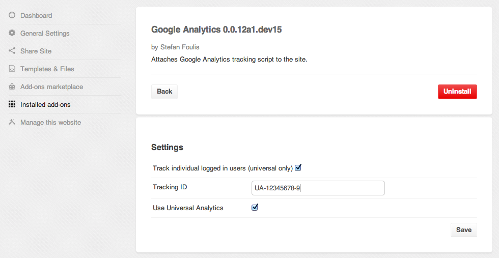

###################
Addon Configuration
###################

Your Addon may have some Django settings, that would nortmally be provided in ``settings.py``. It's not possible to
have direct access to ``settings.py`` on Aldryn, but Aldryn provides an interface to it.

You can make these settings available to your Addon's user through a web form where appropriate. For example, if
your application needs to provide an API key to another service, your Addon can ask the user to supply this information
when it's installed.

***************
Create the form
***************

Add a file ``aldryn_config.py`` to the root of your application (i.e. in the same directory as its ``setup.py``); this
will contain the information for the form.

This file **must** contain a class named ``Form`` which **must** subclass ``aldryn_client.forms.BaseForm``.

The ``Form`` class then contains the fields you want to add to your web form on Aldryn.

Available fields are:

* ``aldryn_client.forms.CharField`` (takes optional ``max_length`` and ``min_length`` arguments)
* ``aldryn_client.forms.CheckboxField``
* ``aldryn_client.forms.SelectField`` (takes a list of tuples as a required second argument)
* ``aldryn_client.forms.NumberField`` (takes optional ``min_value`` and ``max_value`` arguments)
* ``aldryn_client.forms.StaticFileField`` (takes an optional ``extensions`` argument which is a list of valid file extensions)

All fields **must** provide a label as first argument, and provide a keyword argument named ``required`` to indicate
whether this field is required or not.

All fields also support ``help_text`` and ``initial`` keyword arguments.

Custom field validation
=======================

If you need custom field validation, subclass a field and overwrite its ``clean`` method. This takes a single argument
(the value to clean) and should return a cleaned value or raise ``aldryn_client.forms.ValidationError`` with a helpful
message about why the validation failed.

Example:

.. code-block:: python

    # -*- coding: utf-8 -*-
    from aldryn_client import forms

    class EvenNumberField(forms.NumberField):
        def clean(self, value):
            value = super(EvenNumberField, self).clean(value)
            if value % 2 != 0:
                raise forms.ValidationError('Please provide an even number')
            else:
                return value

*******************
Generating settings
*******************

To generate settings, define a ``to_settings`` method which takes two arguments:

* the ``cleaned_data`` of your form
* a dictionary of some existing settings:``MIDDLEWARE_CLASSES``, ``DEBUG`` and ``TEMPLATE_CONTEXT_PROCESSORS``.

You can manipulate these existing settings, and add any new ones your Addon requires.

Example:

.. code-block:: python

    # -*- coding: utf-8 -*-
    from aldryn_client import forms

    class Form(forms.BaseForm):

        ...

        def to_settings(self, cleaned_data, settings_dict):
            if settings_dict.get('DEBUG'):
                settings_dict['EMAIL_BACKEND'] = 'django.core.mail.backends.console.EmailBackend'
            return settings_dict
