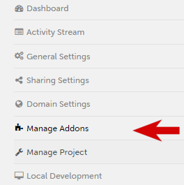
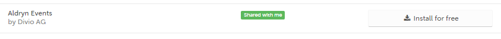
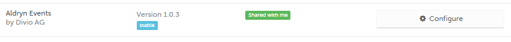
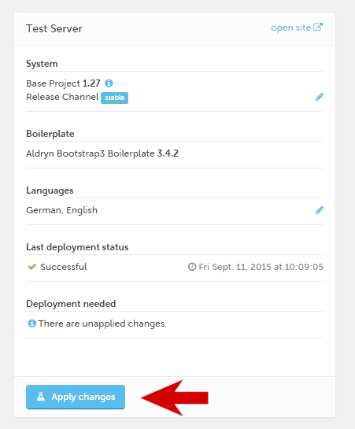
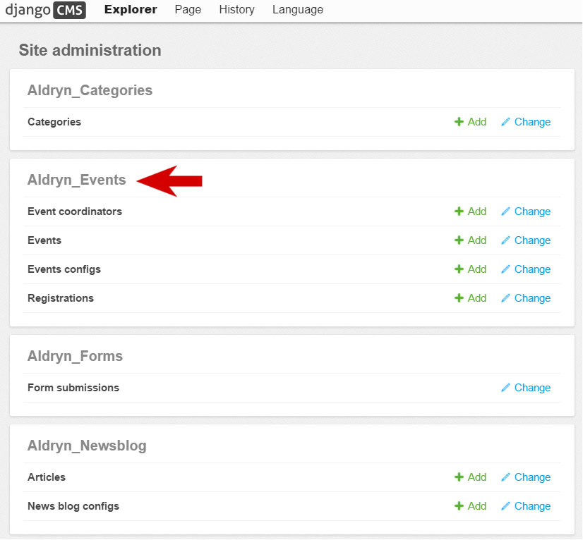
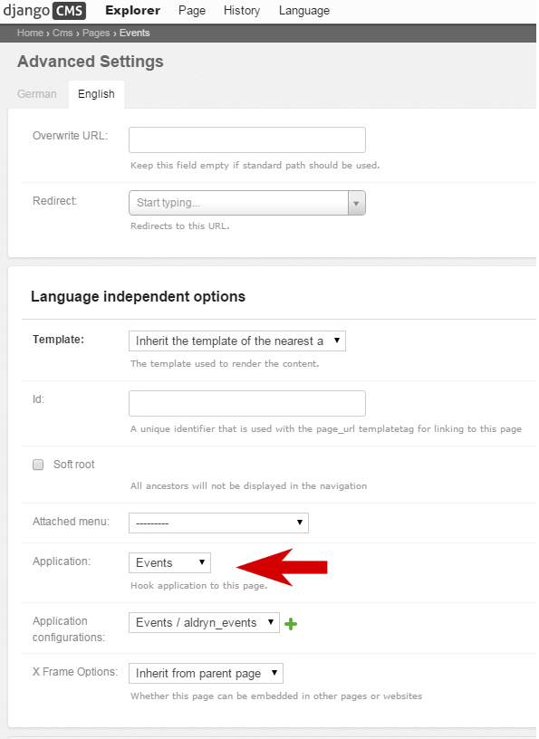
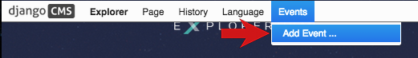
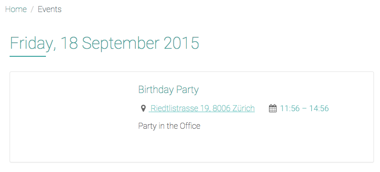
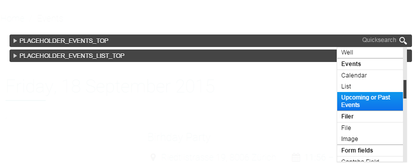
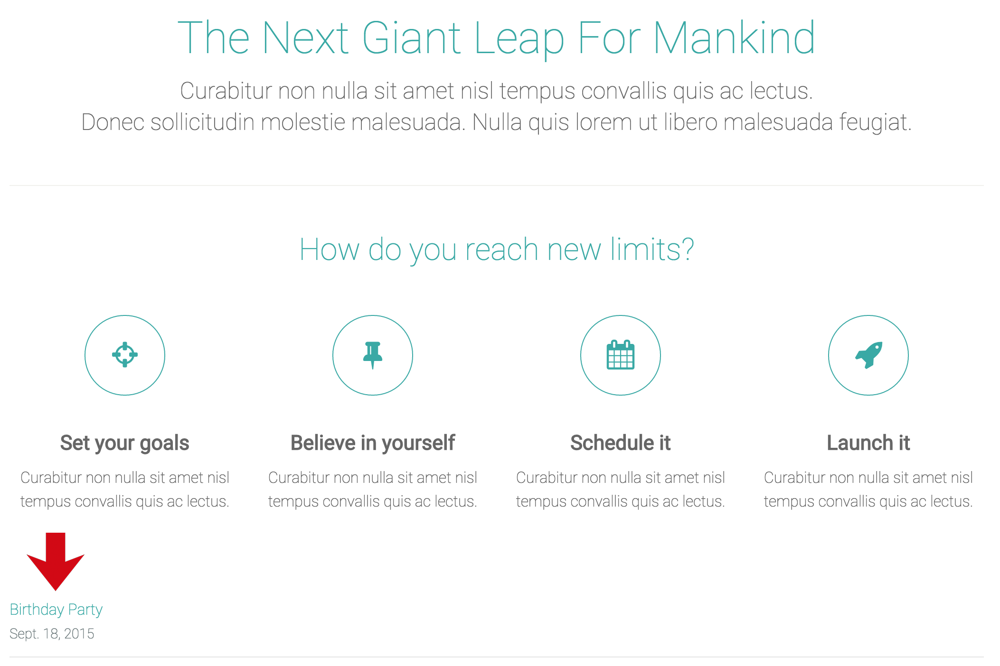

#################################
Using Addons from the Marketplace
#################################

Your *Explorer site* comes with a number of applications installed by default. As well as django CMS, you've already encountered Aldryn News & Blog and Django Filer.

There are many more applications available for django CMS, and a growing number of them are also
available for installation on Aldryn too.

=====================
Install Aldryn Events
=====================

You'll find these Addons in the `Aldryn Marketplace <http://www.aldryn.com/en/marketplace>`_. You
can browse the list there, or install them directly from your Aldryn Control Panel.

In the Dashboard for your site, select *Manage Addons* . You'll see that you have a number
installed already, with others available for installation.

We'll install Aldryn Events, an application for publishing calendars of events on your site.

Find Aldryn Events in the list, and hit **Install for Free**. Don't worry about any installation or
configuration options in the dialoge that appears next, just select **Install Aldryn Events**.

A few seconds later, you'll be returned to the list of Addons, now showing which version of Aldryn
Events that you have installed.

Installing an Addon is a change that requires redeployment of your site. In the Dashboard, hit the
**Apply changes and test** button.

Once the site has redeployed, the new Events application will be
available - you can see it in the admin, as you did with the Filer.

=============================
Create an Events landing page
=============================

By default, a django CMS page's content comes from the plugins you insert into it, but if an
application has a django CMS **Apphook**, this application can insert content into your page
automatically.

For example, the Apphook for the Aldryn News & Blog application is what fills your *Blog* page with
the news articles in the system. We'll do the same with Events.

Create a django CMS page to hook the Aldryn Events application into, using *Page > Add Page* from the Toolbar. Call it *Events*, and select **Save and continue editing**.

In your new page's *Advanced settings*, set its ``Application`` to *Events* and **Save** again.

This page is now hooked into to the Aldryn Events application.

============
Add an event
============

When you're on the *Events* page, you'll see that the django CMS *Toolbar* now contains a new item,
*Events*. Select *Add Event...* from this menu.

Provide some basic details:

* the ``Short description`` is a brief summary of the Event, that will be used in lists of Events
* an event must have a ``Start date``, but the other date/time fields are optional
* for the ``Location``, enter as complete address as possible - Aldryn Events will pass this on to
  Google Maps to display a map, so it needs to be unambiguous and accurate

and **Save** your event.

It now exists in the database and will be listed on the *Events* page. Notice that the calendar
also indicates that something’s on.

.. image:: images/calender.png
   :alt: calender

You can use the standard django CMS placeholder interface to add some more text content to your
events, as you did in :ref:`structure-and-content` earlier.

=============
Using plugins
=============

You've already inserted *Text* plugins into placeholders. Many applications also include their own
plugins, and Events is no exception, offering a number of different plugins.

Go back to the *Home* page, and enter *Structure* mode. Select the *Edit* menu of the *CONTENT*
placeholder, and scroll down through the list of available plugin options until you find the
*Event* plugins. Choose *Upcoming or past events*.

Check the plugin's settings, and **Save**.

The plugin will be inserted at the bottom of the list of plugins in the *CONTENT* placeholder
block, but you can drag it to any position you like (even to another placeholder block).

.. todo:: an image to show plugin being dragged (or maybe two images, before and after)

When you return to *Content* mode, you'll see that on the *Home* page the plugin now automatically
lists the event you created.

