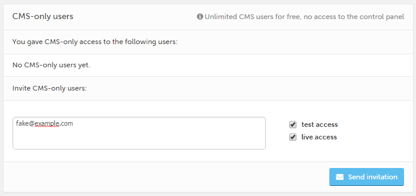

###############################
Sharing and working with others
###############################

A key feature of the Aldryn platform is that it allows you to work with multiple other people, and
to control the levels of access they have to your projects. While you're working on a project, you
can choose to share it with:

* **Visitors**, who will have read-only access to the test site
* **Clients (CMS-only users)**, who have access only to the CMS
* **Collaborators**, who will have access to the control panel as well as the CMS

This is managed in your project's *Sharing settings*.

Go to your project's Dashboard and choose *Sharing settings*.

=====================
Sharing with visitors
=====================

So far, you have been working on your *Test* server, and your website is only visible to you.

Enable a visitor to see it too, by copying the special link and sending it to them. Note that
anyone who has this link will also be able to see your site. None of them will be able to edit your
site though, or see unpublished content.

.. _sharing-with-clients:

=====================================
Sharing with Clients (CMS-only users)
=====================================

You can also give other people access so that they can help edit the site content. This is
particularly useful when you are building a site for a client, so that they are able to make
changes to content you have created, instead of needing you to do it, or if they want to be able to
update content on a day-to-day basis.

To invite *Clients (CMS-only users)*, provide their email addresses, separated by spaces.

You can give them access to the **Live** or **Test** versions of the project or both, as required.

Add a *Client (CMS-only user)* to explore this feature. If the person you add doesn't already have
an Aldryn account, they'll be invited to create one in order to get access to your site.

==========================
Sharing with Collaborators
==========================

.. NOTE::
    For this section, you need to be a member of an Organisation that belongs to a paid-for
    subscription plan - if that's not the case, skip to the next section, Live and Test servers.

A *Collaborator* can help manage the project as well as its content. Obviously, you should only
provide such access to trusted users.

Choose another user and set their access to *On* (note that Admin members of your Organisation will
have already have access rights).

They will now be able to use the Control Panel to install software, deploy the site and make other
changes.
