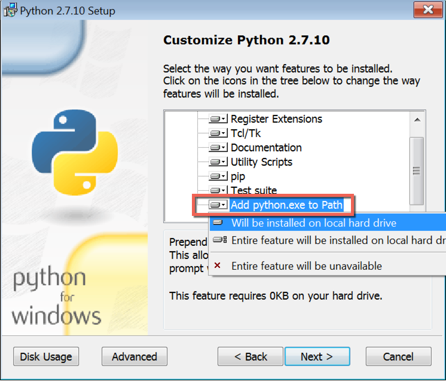
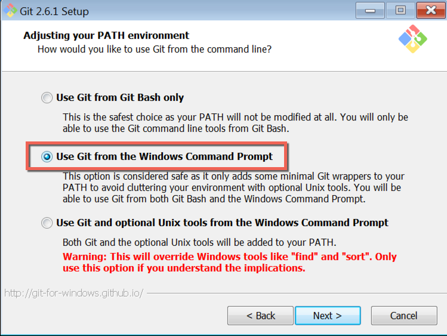
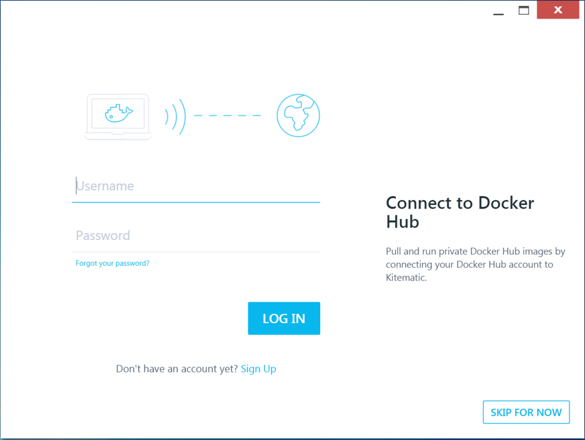
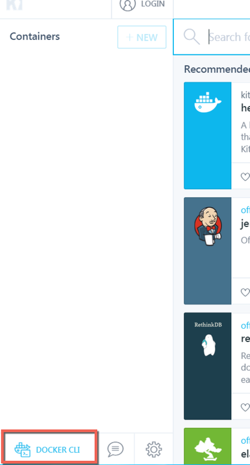

.. _local_dev_install_configure_windows:

#########################################
Installation and configuration on Windows
#########################################

Installing the required software on Windows requires some special steps.

.. attention:: **Not using Microsoft Windows?**

    Please use the :ref:`standard installation instructions <local_dev_install_configure>`.

You'll need to have two special pieces of software installed, **Docker Toolbox** and the **Aldryn
command-line client**. But first, you need to ensure that you have **Git** and an appropriate
version of **Python** installed. This document will help you install and configure all of them.

*******************
System requirements
*******************

At minimum, you will need to be running *Windows 7 Professional 64bit*.

Windows 10 is not yet supported.

**********
Python 2.7
**********

Download the latest version of **Python 2.7** (note that Python 3 is currently not suitable) from
the `official Python website <https://www.python.org/downloads/windows/>`_ and run the installer.

During the installation step "Customize Python", make sure that you have selected the option "Add
Python to Path".

***
Git
***

Download the latest version of Git for Windows from the `Git downloads page
<https://git-scm.com/download/win>`_ and run the installer.

During the installation, make sure you select the option to "Use Git from the Windows Command
Prompt". Amongst other things, this installs the *Git Bash* shell application.

.. _docker_toolbox_windows:

**************
Docker Toolbox
**************

Download the latest version of `Docker Toolbox <https://www.docker.com/toolbox>`_ and run the
installer. This will configure VirtualBox (which will run the virtual machines your local Aldryn
enviroment requires) and Kitematic (a Docker machine controller).

*******
Compose
*******

Install the latest version of ``docker-compose``, a command-line tool for managing Docker containers, using pip.

In your terminal (typically, the ``cmd.exe`` application) run::

    pip install git+git://github.com/docker/compose.git

This will obtain the latest version from the official Docker Compose Git repository, and install it.

**************************
Aldryn command-line client
**************************

Install the Aldryn command line client::

    pip install aldryn-client

.. note::

    until this is formally released on PyPI, use::

        pip install -e git+git://github.com/aldryn/aldryn-client.git@v2#egg=aldryn_client

If you already have an older version of the client installed, use the ``--update`` option::

    pip install --update aldryn-client

You can check the currently installed version by running ``aldryn version``. If it reports a version lower than 2.0, you **must** update.

It is strongly advised to keep the client up-to-date by running ``pip install aldryn-client``
regularly.

.. note::

    This is a good point at which to restart your machine, to help ensure that it starts up with the
    software you have installed ready to use.

.. _upload_key_windows:

**********************************
Upload your public key to Aldryn
**********************************

In order for the Aldryn cloud and your local machine to communicate securely, Aldryn needs to
know your public key to verify your identity.

Visit https://control.aldryn.com/account/ssh-keys/ to check whether you have uploaded your public
key to Aldryn. Any keys already uploaded to Aldryn will be listed there.

If you haven't already done so, you'll need to copy your SSH public key from your
computer and add it to the Aldryn Control Panel. You'll only need to do this once.

.. note:: **If you need help with SSH keys**

    If you need help with setting up, finding or using your SSH keys, use our
    :ref:`guide to setting up SSH keys for Aldryn <setting_up_ssh_keys>` before
    returning to this section.

Having copied your public key to your clipboard, open https://control.aldryn.com/account/ssh-keys/
and paste your key to the *Public key* field. Add a name to the *Title* field to remind you which
computer this key belongs to.

Your Aldryn account will now recognise your computer as a trusted host, and you'll be protected by
encrypted communication for command-line operations between the two.

*************
Set up Docker
*************

Start the *Docker Quickstart Terminal* shortcut and wait until it finishes.

Then open up *Kitematic (Alpha)* from your Desktop. When asked to *Connect to Docker Hub*, hit
**Skip for now**.

.. note::

    If you do find yourself encountering problems with Docker, running ``docker-machine restart
    default`` will usually help.

Once Kitematic is up and running, use the **Docker CLI** button to launch a PowerShell with all
related environment variables pre-configured.

.. note::

    If you prefer to use your own shell instead, the command ``docker-machine env default`` will
    give you instructions on how to set the environment variables properly.

Your new shell will display::

    Machine default already exists in VirtualBox.
    Starting machine default...
                            ##         .
                      ## ## ##        ==
                   ## ## ## ## ##    ===
               /"""""""""""""""""\___/ ===
          ~~~ {~~ ~~~~ ~~~ ~~~~ ~~~ ~ /  ===- ~~~
               \______ o           __/
                 \    \         __/
                  \____\_______/
     _                 _   ____     _            _
    | |__   ___   ___ | |_|___ \ __| | ___   ___| | _____ _ __
    | '_ \ / _ \ / _ \| __| __) / _` |/ _ \ / __| |/ / _ \ '__|
    | |_) | (_) | (_) | |_ / __/ (_| | (_) | (__|   <  __/ |
    |_.__/ \___/ \___/ \__|_____\__,_|\___/ \___|_|\_\___|_|
    Boot2Docker version 1.8.2, build master : aba6192 - Thu Sep 10 20:58:17 UTC 2015
    Docker version 1.8.2, build 0a8c2e3
    docker@default:~$

In the shell, run the command ``aldryn check-system``, which should confirm that all is correct::

    Verifying your system's setup
     ✓ git client
     ✓ docker client
     ✓ docker server connection
     ✓ docker-compose

You're now ready to login and :ref:`start working on a project <run_locally>`.
