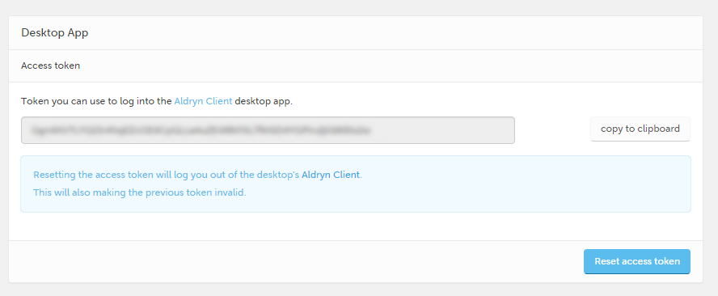
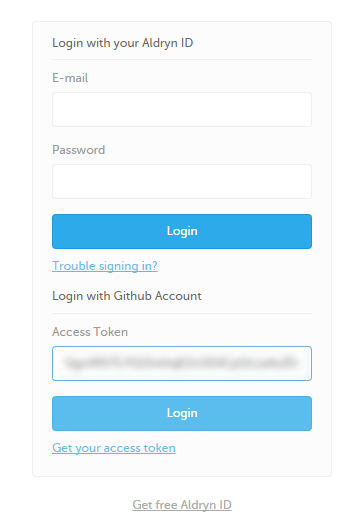

#####################
Customising your site
#####################

We'll move on now from basic project and content management to some of the basics of web
development using Aldryn.

Aldryn has been designed to be developer-friendly, and to reflect the fact that content managers
and developers work together in the same teams, and often on the same projects at the same time. In
particular, Aldryn puts your project's frontend files - HTML, CSS and JavaScript - at your
fingertips for easy management, in various different ways.

The quickest way to explore your project's frontend files is through the Control Panel's built-in
**online editor**.

In the Dashboard, hit **Edit Project files** and select *Edit files with the online editor*. The
online editor will open, listing your project's files.

.. todo:: an image for Edit project files > Edit files with the online editor

==================================
Edit a file with the online editor
==================================

Find the file ``private/SASS/settings/_bootstrap.scss``, and open it by double-clicking.

.. todo:: an image for the file in the file list

In the file, find the line::

    $text-color: #666;

.. todo:: an image of the file editor with about seven lines listed and the appropriate line highlighetd

and change ``#666`` to ``red``. Hit **Save**.

Switch back to your website, and in a few seconds the page will reload, and body text will now be
red.

How this works
==============

When you save a change in the online editor, Aldryn recognises it. You'll notice *Live reload is
ON* in the Toolbar of your website. In this case, we changed a value that controls the default text
colour in the site, and that change was recognised, and showed up when the page was automatically
reloaded.

.. todo:: an image for Live reload is ON in the toolbar

This site uses ***SASS***, a CSS processing language. SASS saves you building complex CSS by hand,
and instead processes your rules - ``.scss`` files in the ``private`` directory - and creates
standard CSS files as output.

You'll find the generated CSS files in ``static/CSS``, but **don't edit them there** - any changes
you make will only be overwritten next time your CSS is rebuilt.

You can learn more about `the SASS language <http://sass-lang.com>`_ and `the Compass framework
<http://compass-style.org>`_ that we use to build our CSS in the Explorer site.

You don't have to use SASS or Compass in your own Aldryn site, but sites based on the `Aldryn
Boilerplate Bootstrap 3 <http://www.aldryn.com/en/marketplace/aldryn-bootstrap3/>`_ - such as this
one - are built around it.

You can edit templates and JavaScript in just the same way as you edited the CSS.

===========================================
Using the Aldryn Desktop client application
===========================================

Using the online editor is suitable for very minor quick changes, but it's not intended for more
extended work. For this, you need to work with your files locally, using tools designed to manage
complex file structures. This is what the **Aldryn Desktop** client application is for.

Install the Aldryn Desktop client.

.. todo:: an image to show link from Dahsboard to download app, *once* the new app is available

Once it's running you can login using your email address and password, or simply copy the `access
token <https://control.aldryn.com/account/desktop-app/access-token/>`_ from the Aldryn Control
Panel and paste it into the field in the client.

One final configuration step is required; you need to specify a local folder where the application
will store your Aldryn files.

Like the Control Panel, the Aldryn Desktop client lists your projects, and offers much of the same
functionality, so it should look very familiar.

Select your project, and set a ``Destination`` folder for its files (create this inside the one you
specified earlier).

Hit **Auto-sync this project**. A few moments later you'll find all your project's files available
on your local drive.

.. image:: images/auto-sync.png
   :alt: auto-sync

As you did before, find the file ``private/SASS/settings/_bootstrap.scss``, and once again change
the ``$text-color`` value.

.. todo:: an image to show file in the OS X Finder and in a text editor

Save the file, and in a few moments later you'll see the change reflected on your site - as long as
*Auto-sync* is turned on, changes will be synchronised in both directions between your site and
your local files.

Having these project files available to you locally, with a seamless connection to the site, means
you don't need to work with tools like FTP, or develop locally and then apply changes to your site
when they're complete - you can work locally using your preferred tools and environment and see the
results immediately online.

You can even collaborate with others on the same site, at the same time, and immediately see the
results of their work.
