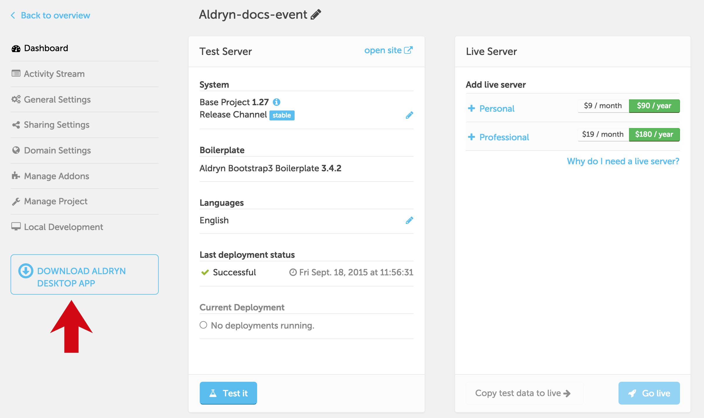
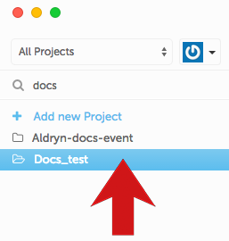
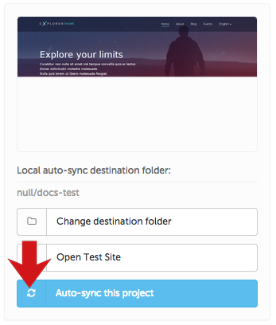
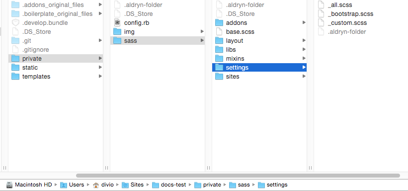

#####################
Customising your site
#####################

We'll move on now from basic project and content management to some of the basics of web
development using Aldryn.

Aldryn has been designed to be developer-friendly, and to reflect the fact that content managers
and developers work together in the same teams, and often on the same projects at the same time. In
particular, Aldryn puts your project's frontend files - HTML, CSS and JavaScript - at your
fingertips for easy management, through the **Aldryn Desktop** client application.

=============================================
Install the Aldryn Desktop client application
=============================================

Download the Aldryn Desktop client, and follow the instructions to install it.

===============
Getting started
===============

Once the application is running you can login using your email address and password, or simply copy
the `access token <https://control.aldryn.com/account/desktop-app/access-token/>`_ from the Aldryn
Control Panel and paste it into the field in the client.

Select a workspace folder (a folder on your computer where you'd like to keep all the Aldryn
files), then select **Continue**.

The Tour
========

At this point you can take the Aldryn Desktop application tour if you wish, though you will
probably find most of its interface and functionality quite familiar, as it's very similar to that of the Control
Panel.

===================
Select your project
===================

Select the project you created in the Control Panel earlier.

Hit **Auto-sync this project**. A few moments later you'll find all your project's files available
on your local drive, in the folder you specified above.

===================
Edit a file locally
===================

Open the local site files.

These are all the frontend - HTML, CSS and JavaScript - files for your site, and can be edited
using your preferred plain-text editor.

Find and open the file ``private/SASS/settings/_bootstrap.scss``.

In the file, find the line::

    $text-color: #666;

and change ``#666`` to ``red``, then save the file.

Switch back to your website, and in a few seconds the page will reload, with the body text now
red to reflect your changes.

This works for any file: save it, and in a few moments later you'll see the change reflected on
your site - as long as *Auto-sync* is turned on, changes will be synchronised in both directions
between your site and your local files.

How this works
==============

When you save a change to any of the local files, Aldryn Desktop recognises this, and sends the
changes to your Aldryn site, along with a signal that files have changed.

You'll notice *Live reload* is *ON* in the Toolbar of your website, which means that your site will
recompile the files, and reload the page to display the changes,

This site uses **SASS**, a CSS processing language. SASS saves you building complex CSS by hand,
and instead processes your rules - ``.scss`` files in the ``private`` directory - and creates
standard CSS files as output.

You'll find the generated CSS files in ``static/CSS``, but **don't edit them there** - any changes
you make will only be overwritten next time your CSS is rebuilt.

You can learn more about `the SASS language <http://sass-lang.com>`_ and `the Compass framework
<http://compass-style.org>`_ that we use to build our CSS in the Explorer site.

You don't have to use SASS or Compass in your own Aldryn site, but sites based on the `Aldryn
Boilerplate Bootstrap 3 <http://www.aldryn.com/en/marketplace/aldryn-bootstrap3/>`_ - such as this
one - are built around it.

You can edit templates and JavaScript in just the same way as you edited the CSS.

Having these project files available to you locally, with a seamless connection to the site, means
you don't need to work with tools like FTP, or develop locally and then apply changes to your site
when they're complete - you can work locally using your preferred tools and environment and see the
results immediately online.

You can even collaborate with others on the same site, at the same time, and immediately see the
results of their work. If another developer makes a change to a site file, that will be
synchronised to *your* local files too, as long as your Aldryn Desktop is running and the project
is set to *Auto-sync*.
