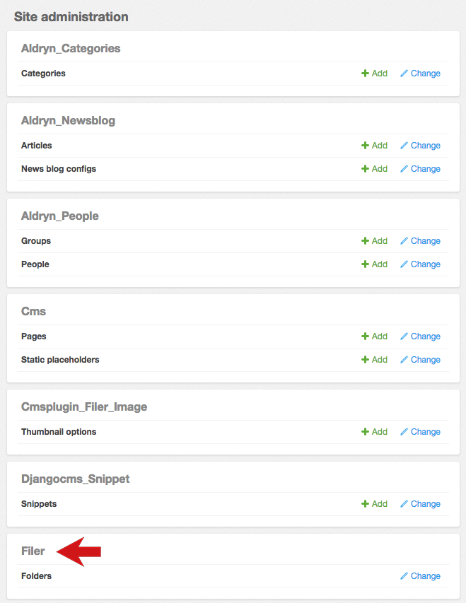

#############################
Working with files and images
#############################

This section only covers the very basics to help you get started. If you're already familiar with
Django Filer you can skip this section.

You'll often need to include files, such as image files, PDFs and so on, in your content management
work. Django Filer, which is one of the core applications built into Aldryn, is an ideal way to
store, retrieve and manage these files.

We're assuming that you are following the tutorial using a copy of the Explorer site as
recommended, which means that your project's Filer already contains some suitable images.

===============
Change an image
===============

To explore the basic use of Django Filer, we'll start by changing an existing image. Find an image
in a page, and hover over it in *Draft mode* - you'll see the indicator that shows this is an
*Image*.

Double-click to open the plugin.

You can change such things as the image's ``Title``, but you can also change the image itself.

Select the **search** icon (the magnifying glass) next to the thumbnail image. Navigate through the
folder structure to find a suitable image. You can also search for files by name.

When you have found a file you'd like to use, hit the **Select this file** icon on its left.

**Save**, and the new image will be used in place of the existing one.

============================
Add a new image to the Filer
============================

If a suitable image does not already exist in the Filer, you can add a new one.

Open the plugin as before, hit the **search** icon, and then the **Upload** button.

Chose an image - or multiple images - from your local drive. After a few moments for processing,
they will appear on the *Clipboard*.

Navigate to the folder where you want to place these files, then hit the **Paste** icon to move
them from the *Clipboard* to the folder. (You can also move items to the clipboard using the Move
to clipboard icon, and also discard items from the Clipboard if required.)

Now you can select the image to use for the plugin as you did before, and **Save** the plugin.

===================================
Using the Filer in the Django Admin
===================================

So far we have got into the Filer via an image plugin, but sometimes it's convenient to get there
directly.

In the Toolbar, select the *Site menu* and choose *Administration*.

Expand the Admin view by hitting the sidepane's **Zoom button**. In the *Filer* section select
*Folders*, where you can explore the folder structure, and use the Filer interface as before.

=============================
Editing an image in the Filer
=============================

Locate the image you added to the Filer earlier, and hit its thumbnail icon there.

Now you can edit the file's settings, such as ``Name``, ``Description`` and ``Author`` - change
them appropriately.

Choose the image's *focus point* - the point around which any cropping will occur - by dragging the
red circle in the image pane.

This helps ensure for example that however a portrait is cropped, the subject's head will not be
chopped off. If your image doesn't have a particular focus point, leave the circle in the middle of
the image.

**Save** the image.

Note that if you change the focus point, any examples of that image already in your pages will
change automatically.

=======================================
Insert an Image plugin in a Text plugin
=======================================

Open a Text plugin by double-clicking on it, as you did in :doc:`/tutorial/basic-content-editing`
above. Place the cursor at the point where you want the image to be inserted, and select *Image*
from the *CMS Plugins* menu.

The *Add Filer image* dialog will open.

You can add an optional caption, or set some of the additional options, and when ready, hit **OK**
to insert the image into the text plugin.

Once you **Save** the text plugin, you'll be able to see the image in your page.
