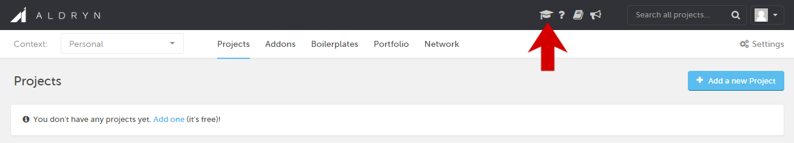

############################
Register your Aldryn account
############################

An Aldryn account is free.

You can sign up for Aldryn using your GitHub account, or your email address.

Select *Sign up* from the menu, or visit the `registration page <http://www.aldryn.com/en/sign/>`_.

.. image:: images/signup.png
   :alt: The sign up link in the menu bar

=======================
To sign up using GitHub
=======================

.. image:: images/btn_github.png
   :alt: Sign up with GitHub
   :align: right

You will need to authorise Aldryn to obtain your email address, and basic information about people
in your GitHub organisations, from GitHub.

================================
To sign up with an email address
================================

Provide an email address, and select **Create my account**. You will receive an email message with
instructions on how to set up your account.

=============
Take the Tour
=============

Once you have logged in to your account, you'll see the Aldryn **Control Panel**, the command centre
for all your Aldryn projects. Once created, all your projects will appear here.

Select the **Tour** icon to take the tour.

You'll be introduced to key parts of the Aldryn interface, and invited to create your first
project. The tour is always available to refresh your memory later.
