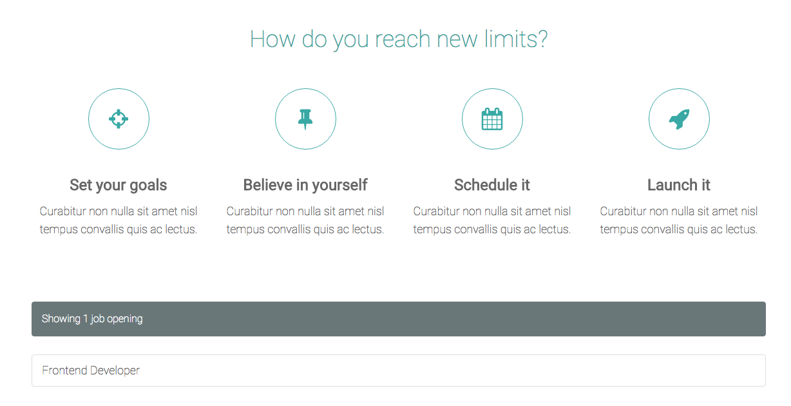

#################################
Using Addons from the Marketplace
#################################

Aldryn News & Blog, Django Filer and Aldryn Events are just three of the pre-installed Addons in
the Explorer site.

There are many more applications available for django CMS, and a growing number of them are also
available for installation on Aldryn too.

===================
Install Aldryn Jobs
===================

You'll find these Addons in the `Aldryn Marketplace <http://www.aldryn.com/en/marketplace>`_. You
can browse the list there, or install them directly from your Aldryn Control Panel.

.. image:: images/manage-addons.png
   :alt: Select 'Manage Addons' from the menu
   :align: right
   :width: 30%

In the Dashboard for your site, select *Manage Addons* . You'll see that you have a number
installed already, with others available for installation.

We'll install Aldryn Jobs, an application for publishing information about job vacancies on your
site.

Find Aldryn Jobs in the list, and hit **Install for Free**.

You'll be asked for a default email address for notifications (for when candidates submit
applications and so on), so enter something suitable there, then hit the **Install Aldryn Jobs**
button.

A few seconds later, you'll be returned to the list of Addons, now showing which version of Aldryn
Jobs that you have installed.

Installing an Addon is a change that requires redeployment of your site. In the Dashboard, hit the
**Apply changes** button.

.. image:: images/apply-changes.png
   :alt: the 'Apply Changes' button
   :width: 50%
   :align: center

Once the site has redeployed, the new Jobs application will be
available - you can see it in the admin, as you did with the Filer.

==========================
Create a Jobs landing page
==========================

:ref:`As you did previously for Aldryn Events <create-events-apphook>`, create a *Jobs* landing
page:

* create a new page called *Jobs*
* in its *Advanced settings*, set its ``Application`` to *Jobs* and **Save** again
* publish the page

.. note::

    Sometimes after making changes related to Apphook configuration, you will see an error on your
    django CMS page. This is a temporary error. Refresh the page after a few moments and the error
    will have resolved itself.

    A future update will address this.

=========
Add a job
=========

When you're on the *Jobs* page, you'll see that the django CMS *Toolbar* now contains a new item,
*Jobs*. Select *Add new job opening...* from this menu.

Provide some basic details:

* the ``Short description`` is a brief summary of the job, that will be used in lists of job
  vacancies
* a job opening must have a *Category*; hit the *plus* icon to add a new category
* you can add dates to control when the item will be published

and **Save** your job opening.

It now exists in the database and will be listed on the *Jobs* page, as long as it's *Active* and
not excluded by dates that you entered.

.. image:: images/job-example.png
   :alt: a published job
   :align: center

You can use the standard django CMS placeholder interface to add some more text content to your
job openings, as you did in :ref:`structure-and-content` earlier.

=============
Using plugins
=============

You've already inserted *Text* and *Events* plugins into placeholders. Many applications also
include their own plugins, and Jobs is no exception, offering a number of different plugins.

Go back to the *Home* page, and enter *Structure* mode. Select the *Edit* menu of the *CONTENT*
placeholder, and scroll down through the list of available plugin options until you find the
*Jobs* plugins (*Job list* and *Categories list*). Choose *Job list*.

Check the plugin's settings, and **Save**.

The plugin will be inserted at the bottom of the list of plugins in the *CONTENT* placeholder
block, but you can drag it to any position you like (even to another placeholder block).

When you return to *Content* mode, you'll see that on the *Home* page the plugin now automatically
lists the job you created.

