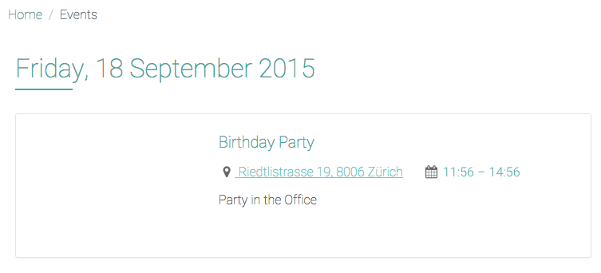
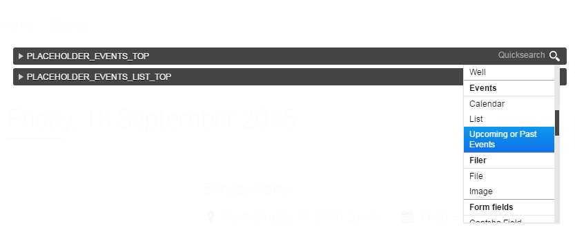

##########################################
Applications, Apphooks and plugins
##########################################

Your *Explorer site* comes with a number of applications installed by default. As well as django
CMS, you've already encountered Aldryn News & Blog and Django Filer.

Another application that is pre-installed is Aldryn Events. We'll explore some key django CMS
functionality through this.

.. _create-events-apphook:

=============================
The Events landing page
=============================

Find the *Events* landing page on the site.

This page contains information about various forthcoming events.

These events, and this page, are created by a separate application, Aldryn Events, that integrates
into django CMS using an **Apphook**.

.. note:: **About Apphooks**

    By default, a django CMS page's content comes from the plugins you insert into it, but if an
    application has a django CMS **Apphook**, this application can insert content into your page
    automatically, from a different source.

    For example, the Apphook for the Aldryn News & Blog application is what fills your *Blog* page
    with the news articles in the system, and the same is true of the Events page.

    You can see the Apphook by selecting *Page* > *Advanced settings* > *Application* from the
    Toolbar, which shows that this page is hooked into to the Aldryn Events application.

============
Add an event
============

#.  Hit **Create** in the toolbar.
#.  Select *New event* and hit **Next**.
#.  Provide some basic details:

    * the ``Short description`` is a brief summary of the Event, that will be used in lists of
      Events
    * an event must have a ``Start date``, but the other date/time fields are optional
    * for the ``Location``, enter as complete address as possible - Aldryn Events will pass this on
      to Google Maps to display a map, so it needs to be unambiguous and accurate

#.  **Save** your event.

It now exists in the database and will be listed on the *Events* page. Notice that the calendar
also indicates that something’s on.

You can use the standard django CMS editing interface to continue your
event, as you did in :ref:`structure-and-content` earlier.

=============
Using plugins
=============

You've already inserted *Text* plugins into placeholders. Many applications also include their own
plugins, and Events is no exception, offering a number of different plugins.

Go back to the *Home* page, and enter *Structure* mode. Select the *Edit* menu of the *CONTENT*
placeholder, and scroll down through the list of available plugin options until you find the
*Event* plugins. Choose *Upcoming or past events*.

Check the plugin's settings, and **Save**.

The plugin will be inserted at the bottom of the list of plugins in the *CONTENT* placeholder
block, but you can drag it to any position you like (even to another placeholder block).

When you return to *Content* mode, you'll see that on the *Home* page the plugin now automatically
lists the event you created.

.. image:: images/homepage-event.png
   :alt: The plugin at work in the home page

=================
Exploring further
=================

There are numerous pre-installed applications on the Explorer site that work in the same way.

As well as News & Blog and Events, you'll find People, Jobs and FAQ.

To create new content for any of them, just start by hitting **Create** in the toolbar, and follow
the steps.
