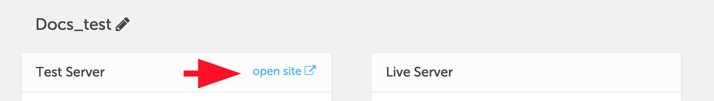
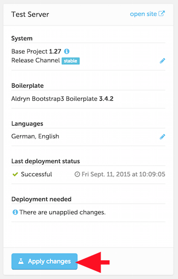
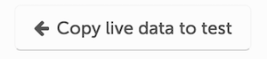

#####################
Live and Test servers
#####################

Aldryn provides you with two servers for each project. To change a site's configuration, your
changes must be first deployed to the *Test* server, so they can be properly assessed. Once you are
satisfied that the new configuration works as expected you can deploy it to the *Live* server. In
other words, only the *Test* server's settings can be changed directly.

The *Test* server is private. Only you and the users you choose to share it with can view the site.

The *Live* server is public. Note that you can only use the Live server if you have a paid-for
Aldryn site.

In the Dashboard, each server has its own pane, with information about its status and
configuration, and configuration controls. There's also an **open site** link that will take you to
the deployed website for each.

Use the **open site** link of your Test server to access the website.

===============
The test server
===============

The *Test Server* pane displays information about the System and Boilerplate versions, and
indicators to show whether they can be updated, in which case a button to apply the updates will be
available.

At any time, you can use the **Test it** button to deploy the current configuration, whether it has
been previously deployed or not.

Hit **Test it**. Your site will redeploy the way it did when you first created it.

===============
The live server
===============

The *Test* server provides you with a complete Aldryn website, with all its functionality. However,
the site remains private, available only to you and :ref:`the people you have shared it with <sharing-with-clients>`. To publish your site for the world to see, you need a *Live* server.

As well as giving you a public site, a *Live* server allows you to host it from your own domain
domain name. (See :ref:`domain_names` for more.)

In order to deploy a Live server, your project needs to belong to a paid-for Aldryn account. For
each project you can choose between a *Personal* (suitable for lower-traffic sites) or
*Professional* (suitable for higher-traffic sites, with more disk space and higher performance)
live server. See our `Aldryn pricing page <http://www.aldryn.com/en/pricing/>`_ for information
about these options.

If your project does not belong to a paid-for account, the sections below will not apply, so skip
to the next section, :ref:`files-and-images`.

=======
Go live
=======

When you're ready to publish your site, hit **Go live** - |go-live|. Your site will go through the familiar
deployment process, but this time on the live rather than the test server.

Once complete, your site will be publicly available, and not just to people your are collaborating
with.

**Go live** copies the configuration - settings, installed Addons and so on - from the test server
to the live server, overwriting the configuration on *Live*.

You can now make further changes to the test server, but your live site won't be affected until you
once again use **Go live** to redeploy the test configuration to the live server.

=========================================
Copying data from one server to the other
=========================================

.. WARNING::

    Be aware that the copying action is *destructive* - it overwrites the content on the destination
    server. Don't use the copy function unless you are sure you want to overwrite the content on
    your *Live* or *Test* sites.

Copying test data to live
=========================

As well as applying your *Test* server's *configuration* to the *Live* server, you can also copy
its *data* - the actual site content, using the **Copy test data to live** button.

This allows you to work on site content on a completely private server, and then to publish it all
at once when you are ready.

Create and publish some new pages on the test server, then copy your test content to live by using
the **Copy test data to live** button.

Check that the live server now also features the new pages.

Copying test data to live
=========================

The **Copy live data to test** button will copy all site content in the other direction, so that
you can test new configurations with existing data.

Typically, you will use this when testing an updated version of software, such as an *Addon*, to
ensure that it will work correctly when later deployed to the live server.

How you use these commands is up to you, and will be determined by your preferred workflow.

